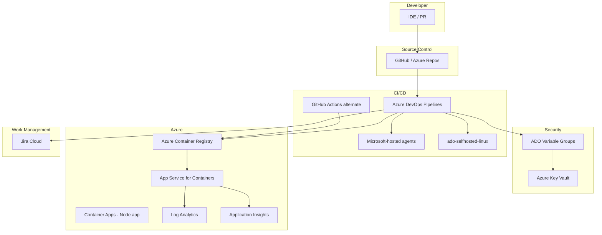

# Target Architecture — DevOps Migration Assessment

## Current state

- **SCM:** GitHub (candidate repo) / legacy GitLab on-prem
- **CI/CD:** Jenkins, Bamboo, GitLab CI (`legacy-ci/`)
- **Deploy:** SSH to VMware VMs with local Docker
- **Artifacts:** Nexus, corporate registry
- **Work tracking:** Jira Server/Data Center

## Target state

## Ingress

| Layer | Local (Module D) | Azure |
|-------|------------------|-------|
| Edge | nginx :8080 | App Service HTTPS / App Gateway / ACA ingress |
| App | Spring PetClinic :8080 | Container port 8080 |
| Health | `/actuator/health` | Same path |

**Path:** `User → TLS ingress → app → actuator health`

## Egress (least privilege)

| Destination | Port | Purpose |
|-------------|------|---------|
| PostgreSQL | 5432 | Application data |
| `*.vault.azure.net` | 443 | Secrets |
| `*.azurecr.io` | 443 | Image pull |
| Partner API | 443 | External integration (mock locally) |
| Package registries | 443 | Build time only (agents) |

See `k8s/networkpolicy-egress.yaml` for AKS enforcement.

## Containerization (Module C)

- Multi-stage Dockerfile in `container/Dockerfile`
- Non-root user UID 10001
- Tests run in build stage before image promotion

## Secrets and identity

- **No secrets in YAML or Dockerfiles**
- Key Vault + managed identity on App Service
- ADO service connection `azure-migration-sc` (OIDC preferred)
- GitHub Actions federated credentials for alternate path

## Azure landing zone (assessment)

| Setting | Value |
|---------|--------|
| Subscription | `c09dd6ef-0111-4bf0-a0d4-3600979a0c7d` (Azure subscription 1) |
| Resource group | `rg-migration-assessement` |
| Region | `southeastasia` |
| IaC (Module E) | Terraform — [`iac/terraform/`](../iac/terraform/) |

## Runtime choices

| App | Primary runtime |
|-----|-----------------|
| Spring PetClinic | App Service for Containers (in shared RG) |
| Python Flask | App Service or ACA (deploy into shared RG) |
| Node Todo | Azure Container Apps (upstream pattern; pass shared RG name) |

## Release governance (Module N)

- Branch policies on `main`: PR required, build validation
- Environments: `dev` (auto), `prod` (approval + smoke test)
- Segregation: approver ≠ deployer (documented in `cutover-plan.md`)

## Large-scale migration factory

1. **Discover** — `pipeline_inventory_analyzer.py` across estate
2. **Classify** — `module-b-migration-mapping-matrix.csv` decisions
3. **Convert** — reusable templates in `pipelines/templates/`
4. **Validate** — dev deploy + smoke per wave
5. **Cutover** — `cutover-plan.md` per application wave
6. **Hypercare** — `migration-runbook.md`
